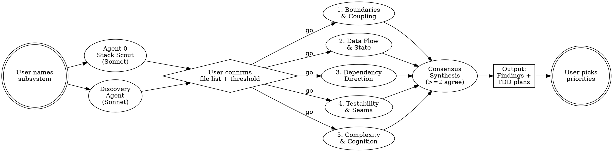

# Architecture Audit

## Overview

Dispatch a team of senior-architect agents to audit a single subsystem named by the user. Each agent examines the same code through a different architectural lens. A finding survives to the final report only if at least two lenses agree on it. The skill outputs a prioritized list of TDD-ready refactoring tasks directly to the conversation.

**Non-negotiable constraints:**
1. No skill action changes application code. Output is findings and TDD-ready tasks; the user owns implementation.
2. No findings against files outside the user-confirmed scope. Read-only peeks are allowed under defined rules; new findings against peeked files are not.
3. No single-agent findings in the main report, except where severity is Critical with strong evidence.

## When to Use

- Before refactoring a large subsystem
- When a subsystem "feels architecturally off" but you lack a concrete diagnosis
- During onboarding to a complex piece of an unfamiliar codebase
- When deciding whether a piece is worth refactoring at all

## When NOT to Use

- Whole-codebase quality audit -> use the `*-code-quality-audit` skills instead
- Security review -> use `security-review`
- Style/lint concerns -> use a linter
- Bug hunt or behavior change -> this skill never changes logic

## Pipeline



## Step 1 - Subsystem Intake

Ask the user to name the subsystem in plain English. Examples: "the web authentication system", "the report-generation pipeline", "the websocket connection layer". Do not infer a subsystem from context; the user must name it. Vague answers ("the backend") should be pushed back on for narrower scope.

## Step 2 - Stack Scout and Discovery (parallel)

Dispatch both agents in a single tool-call block.

### Agent 0 - Stack Scout (Sonnet, fast)

A single quick pass to determine the stack and stack-specific concerns. Use Sonnet to keep this cheap; its output gates the prompts of the expensive architect agents downstream.

**Prompt the agent with:**
> Read root manifests (`package.json`, `Cargo.toml`, `pyproject.toml`, `go.mod`, `Gemfile`, `composer.json`, `pom.xml`, `build.gradle`), root config files (`next.config.*`, `vite.config.*`, `tsconfig.json`, `tauri.conf.json`, framework markers), and sample file extensions across `src/` or repo root. Return:
> ```
> stack: <one of: next.js | elysia | rust | vite-tauri | django | rails | spring-boot | dotnet | unknown>
> framework_version: <version string or null>
> stack_specific_concerns:
>   - <bullet 1>
>   - <bullet 2>
> ```
> Stack-specific concerns must be architectural, not stylistic. Examples for Next.js: "auth checks belong in middleware, not page components", "RSC/client boundary leaks via client-only imports in server components", "route handlers should delegate to a service layer". For unknown stacks return an empty list.

Dispatch via `Agent` with `subagent_type: "general-purpose"` and `model: "sonnet"`.

### Discovery Agent (Sonnet, fast)

Resolves the user's subsystem name into a concrete file set. Runs in parallel with the Stack Scout.

**Prompt the agent with:**
> The user named this subsystem: "<USER_DESCRIPTION>".
>
> Find the files that make up this subsystem:
> 1. Glob/grep for entry-point candidates (filenames, exports, route patterns) matching the description.
> 2. Read the entry points and walk imports one level deep.
> 3. Pull in associated test files.
> 4. Categorize results into four buckets:
>    - **Core** - clearly part of the subsystem.
>    - **Adjacent / called-into** - dependencies of core the subsystem relies on.
>    - **Tests** - test files exercising any of the above.
>    - **Possibly related but uncertain** - referenced by core, used elsewhere too, unclear if in-scope.
>
> Return a structured file list with each file on its own line, grouped by category. Brief one-line justification per file in the uncertain bucket. Do not propose changes; this is a discovery pass.

## Step 3 - User Confirmation Gate (blocking)

After both fast agents return, present the user with:
- The detected stack and stack-specific concerns
- The four-bucket file list

Then ask the user three questions (use `AskUserQuestion` where possible):
1. **Confirm or edit the file list.** User may drop adjacent, promote uncertain to core, or add files the discovery agent missed.
2. **Severity threshold.** Default: Moderate and above; Minor dropped.
3. **Focus areas to emphasize or skip.** Optional free-text.

**Do not dispatch architect agents until the user confirms.** This is the primary off-the-rails guard. The agents physically cannot examine files outside the confirmed list.

## Step 4 - Architect Agents (Opus, parallel, 5 lenses)

Dispatch all five agents in a single tool-call block. Each receives the same confirmed file list, the same `stack_specific_concerns` block appended to its lens prompt, and the same severity threshold.

### Agent 1 - Boundaries and Coupling

> "Where does this subsystem leak into - or leak in from - things it shouldn't?"

Looks for layer violations, leaky abstractions, circular dependencies, oversized public surface, cross-cutting concerns bleeding into core logic.

**Prompt the agent with:**
> You are a senior architect reviewing this subsystem through a single lens: boundaries and coupling. Examine ONLY the files in this confirmed list:
> ```
> <CONFIRMED_FILE_LIST>
> ```
> Apply these stack-specific concerns where relevant:
> ```
> <STACK_SPECIFIC_CONCERNS>
> ```
> Find layer violations, leaky abstractions, circular deps, oversized public surfaces, and cross-cutting concerns that bleed into core logic. For each finding return JSON with: `id`, `files` (paths + line ranges), `severity` (Critical | Moderate | Minor), `principle` (which architectural rule is violated), `evidence` (1-3 short quotes from the code), `direction` (proposed shape, not a diff), `confidence` (low | med | high).
> Drop findings below threshold: <SEVERITY_THRESHOLD>.
> Follow the scope contract below.

### Agent 2 - Data Flow and State

> "Where does state live, where does it mutate, and what's coupled by accident?"

Looks for where state lives vs. where it mutates, hidden side effects, implicit coupling via shared mutable state, request/response shape drift.

**Prompt with:** same shell as Agent 1, lens replaced with: "data flow and state. Find where state lives vs. where it mutates, hidden side effects, implicit coupling through shared mutable state, request/response shape drift across the subsystem."

### Agent 3 - Dependency Direction

> "Are the high-level modules depending on low-level modules in ways that will hurt?"

Looks for inversion violations, god modules, high-incoming-edges hot spots, stable/volatile mismatch.

**Prompt with:** same shell, lens replaced with: "dependency direction. Find inversion violations (high-level depending on low-level), god modules, modules with too many incoming edges, and stable-vs-volatile mismatches."

### Agent 4 - Testability and Seams

> "Could a new engineer test this in isolation tomorrow?"

Looks for untestable units, missing seams, hard-to-mock dependencies, branch-coverage gaps inside the subsystem, integration-vs-unit balance.

**Prompt with:** same shell, lens replaced with: "testability and seams. Find untestable units, missing seams, hard-to-mock dependencies, branch-coverage gaps inside this subsystem, and integration-vs-unit balance problems. Read the test files in scope to inform your analysis."

### Agent 5 - Complexity and Cognition

> "What in here would surprise a senior engineer reading it for the first time?"

Looks for parallel hierarchies, primitive obsession, feature envy across modules, abstractions that don't earn their weight.

**Prompt with:** same shell, lens replaced with: "complexity and cognition. Find parallel hierarchies, primitive obsession, feature envy across modules, and abstractions that don't earn their cost. Flag subsystem-level smells, not single-line nits."

### Scope Contract (appended to every architect agent prompt)

> **Scope contract:**
> - Findings may only be reported on files in the confirmed list. Out-of-scope files cannot be the subject of a finding.
> - **Read-only peek allowed**: if an in-scope file references an out-of-scope file and you suspect that file materially affects the analysis, you may open it to confirm or refute the suspicion.
> - **Peek budget**: 5 files. Soft cap.
> - **Peek reporting**: for each peek, return `{file, why_peeked, did_it_change_analysis}` in a separate `scope_notes` array.
> - If you peek and the file appears materially in-scope but was missed, flag it - you do not need to expand findings into it.

## Step 5 - Consensus Synthesis

After all 5 architect agents return, run a synthesis pass. This can be done in the main thread or as a single follow-up agent dispatch; the main thread is preferred so all raw findings stay in context.

**Rules:**

1. **Merge overlapping findings.** Findings that target the same file/lines and the same architectural concern collapse into one. Use the union of evidence and the maximum severity.
2. **Apply the consensus rule.** A merged finding survives only if backed by >=2 distinct lenses. Exception: a single-lens Critical finding with strong evidence survives, tagged `single-agent`.
3. **List dropped findings** for transparency. Surface them in a dedicated section at the end of the report.
4. **Detect scope-expansion signals.** If >=2 agents peeked at the same out-of-scope file with a relevance reason, list it as a "Consider re-running with expanded scope" candidate at the top.
5. **Generate TDD plan per surviving finding:**
   - **Red**: name the failing test to write, including file location and assertion shape.
   - **Green**: the minimal change that makes the test pass.
   - **Refactor**: any follow-up cleanup once green.

## Output

Print directly to the conversation. Do not write to a file. Use this structure:

```markdown
# Architecture Audit - <Subsystem Name>

> No skill action changed application code. The implementor owns all edits.

## Summary
- Subsystem: <name>
- Stack: <detected stack + version>
- Files in scope: <N> (Core <a>, Adjacent <b>, Tests <c>)
- Findings: <N> (Critical <a>, Moderate <b>, Minor <c>)
- Scope expansion suggested: <list of files, or "none">
- Consensus stats: <kept> surviving / <raw> raw / <dropped> single-agent non-critical

## Critical

### [ARCH-001] <short title>
- Files: `<path:lines>`, `<path:lines>`
- Flagged by: Boundaries, Data flow, Testability (3/5)
- Principle: <which architectural rule is violated>
- Evidence:
  > <quote 1>
  > <quote 2>
- Direction: <proposed shape, no diff>
- Confidence: high

**TDD plan**:
1. Red: <failing test to write, file location, assertion shape>
2. Green: <smallest change to make it pass>
3. Refactor: <cleanup once green>

## Moderate
(repeat shape per finding)

## Minor
(repeat shape per finding)

## Scope Notes
- `<file>` - peeked by Boundaries + Data flow + Testability. <relevance>. <recommendation>.

## Dropped Findings (single-agent, non-critical)
- Complexity agent flagged `<file>:<lines>` as <issue>. Not corroborated by other lenses.
```

## Step 6 - Prioritization (terminal step)

After printing the output, ask the user:

> Which findings do you want to act on, and in what order?

Accept the user's selected IDs. Confirm the prioritized list back to them. Then **stop**. The skill does not edit files, write tests, or commit. The user takes the prioritized list to their next session or invokes `writing-plans` themselves.

## Severity Guide

| Severity | Meaning |
|----------|---------|
| **Critical** | Actively causes maintenance pain, risk of bugs, or blocks scaling; architectural rot worth fixing soon |
| **Moderate** | Clear improvement, worth scheduling in next refactor cycle |
| **Minor** | Nice-to-have, fix opportunistically when next touching the area |

## Rules for All Agents

1. **No behavior changes.** Every recommendation preserves existing functionality exactly.
2. **Be specific.** File paths, line ranges, concrete code references. No vague "consider improving".
3. **Explain WHY.** Every finding states the architectural principle and the concrete cost.
4. **Skip trivial.** Style preferences, formatting, sub-3-line duplication, single-character renames.
5. **Group related.** If five files have the same issue, group them under one finding with the union of paths.
6. **Stay in scope.** Findings only on confirmed files. Peeks reported, not promoted to findings.
7. **One lens, one perspective.** Architect agents do not try to cover other lenses' concerns; the synthesis step combines them.

## Quick Reference

| Step | Who runs | Why |
|------|----------|-----|
| 1. Intake | Main thread | User scopes the subsystem |
| 2a. Stack scout | Sonnet, agent | Cheap pass for stack + concerns |
| 2b. Discovery | Sonnet, agent | Resolve subsystem to file set |
| 3. Confirm | Main thread + user | Lock scope, set threshold |
| 4. 5 lenses | Opus, parallel agents | Independent architectural analysis |
| 5. Synthesis | Main thread | Apply consensus rule, build TDD plans |
| 6. Prioritize | Main thread + user | User picks; skill stops |

## Common Mistakes

- **Letting agents pick their own scope.** Always run discovery + user confirmation first. An agent told to "audit the auth system" will examine half the codebase by lunchtime.
- **Skipping the stack scout.** Without stack-specific concerns the lenses become generic and miss high-value, framework-specific findings.
- **Accepting single-agent findings by default.** The whole point of consensus is that one lens can be wrong or noisy. Keep them in the Dropped section unless Critical.
- **Promoting peeked files into the findings section.** Peeks are for context only. If a peek looks load-bearing, surface it as a scope-expansion candidate and let the user decide.
- **Writing diffs in the Direction field.** Direction is shape, not code. The user will write the failing test first and let the test shape the diff.
- **Continuing past the prioritization step.** The skill ends after the user picks priorities. No edits, no commits, no test scaffolding. That is the user's next session.
- **Using Opus for the stack scout.** Stack detection is mechanical. Sonnet is faster and cheaper and the architect agents need the budget more.
