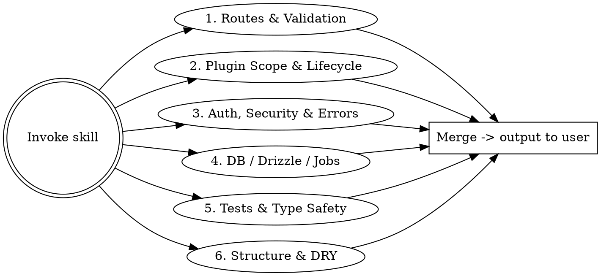

# Elysia Code Quality Audit

## Overview

Dispatch a team of specialized agents to audit an Elysia (Bun) backend in parallel. Each agent examines one concern. Designed to run against a single app inside a monorepo (e.g., `apps/api`), so all path patterns assume the audit's working directory is the app root. Results are merged and output directly to the conversation.

**Non-negotiable constraint:** No fix may change application behavior. Every recommendation targets code structure, test coverage, abstraction, validation, security configuration, or readability - never logic.

## When to Use

- Before a major refactor or release stabilization of a backend service
- When inheriting or onboarding to an Elysia app
- After upgrading Elysia majors (e.g., 0.x -> 1.x, or v1 minor bumps that change plugin scope semantics)
- When the API "feels messy" but you lack a concrete list of issues
- Periodic hygiene check on a long-lived service

## Inputs

The skill expects to be invoked from inside a single Elysia app (e.g., `cd apps/api`). If invoked from a monorepo root with multiple Elysia apps, ask the user which app to audit, then run from that directory. Do not try to audit multiple apps in one pass - the findings list becomes unusable.

## Agent Team

Dispatch **all six agents in parallel** using the Agent tool. Each agent returns its findings as structured output. After all complete, merge and output directly to the conversation.



### Agent 1 - Routes & Schema Validation

> "Does every route declare what it accepts and returns?"

Look for:

| Pattern | Should Be |
|---------|-----------|
| Route handler accessing `body`, `query`, `params`, `headers` without a `t.Object(...)` schema | Typed schema in the route options |
| `body: any` / untyped destructuring of `body` | Explicit TypeBox schema |
| `response` schema missing on a public route | Typed response (catches drift, drives OpenAPI) |
| Per-route ad-hoc validation (`if (!body.email) ...`) duplicating what a schema would enforce | Schema with `t.String({ format: 'email' })` |
| `set.status = 400` with stringified errors instead of typed problem responses | Shared error response schema |
| Routes returning `Response` directly that bypass Elysia's response handling | Plain object + status |
| `app.get('/x', ...)` paths repeated across files (path collisions or near-duplicates) | Single canonical route |
| `parse: 'json'` / `type: 'json'` overrides where the default would work | Default behavior |
| Routes that don't `.use(authPlugin)` or equivalent but read user-scoped data | Auth-required scope |
| File upload routes without a size/type guard | `t.File({ maxSize, type })` |
| Pagination params (`limit`, `offset`, `cursor`) declared per route differently | Shared pagination schema macro |

**Prompt the agent with:**
> Enumerate every Elysia route in this app (search for `.get(`, `.post(`, `.put(`, `.patch(`, `.delete(`, `.all(`, `.route(`, and `Elysia()` chains). For each route, report: (a) does it declare schemas for `body`/`query`/`params`/`headers` it actually uses, (b) does it declare a `response` schema, (c) does any handler validation duplicate what a schema would have caught, (d) does the route enforce auth if it reads user-scoped data. Group routes that share a missing pattern (e.g., "12 routes destructure `body` with no schema"). Skip purely internal/health routes from response-schema findings.

### Agent 2 - Plugin Scope, Lifecycle & Composition

> "Are plugins using the right scope, and are lifecycle hooks doing what people think?"

Examine `Elysia` instance composition, `.use()` calls, and lifecycle hooks (`onRequest`, `onParse`, `onTransform`, `onBeforeHandle`, `onAfterHandle`, `onError`, `onResponse`, `derive`, `resolve`, `state`, `decorate`):

- Plugins that should be `{ scoped: true }` but pollute the parent scope (Elysia's "scoping" mechanic - everything is local by default in v1, but plugins frequently get exported in ways that break this)
- `as: 'global'` or `as: 'scoped'` used without a clear reason (default `'local'` is usually right)
- Plugins instantiated inline on every request instead of once at module scope
- `derive` / `resolve` that does work on every request when it could be `state` (computed once)
- `onBeforeHandle` hooks that do auth checks but aren't paired with route-level macros - easy to forget on new routes
- Two plugins both defining the same `state`/`decorate` key (silent collision)
- A plugin file that exports `new Elysia()` but is named like a utility - confuses scoping
- `onError` defined per-route when a single global handler would do
- Plugins with side effects at import time (DB connections, env reads) that make tests slow or order-dependent
- Missing `.name` on plugins (defeats Elysia's plugin deduplication)
- Macros that could replace repeated `onBeforeHandle` patterns across many routes

**Prompt the agent with:**
> Map the plugin graph. List every file that exports `new Elysia(...)`, the `.name` it sets (or doesn't), and which other files `.use()` it. For each, decide whether the scope is right - especially whether `derive`/`resolve`/`state` leak into parent scopes unintentionally. Flag plugins instantiated inside route handlers, lifecycle hooks duplicated across routes that should be a macro, missing `.name` (which breaks deduplication), and import-time side effects that complicate testing. Be specific: name the plugin, name the consumer, name the leak.

### Agent 3 - Auth, Security & Error Handling

> "Is the attack surface tight, and do errors leak nothing dangerous?"

Look for:

**Auth (Better Auth or otherwise):**
- Routes that touch user-scoped data without a session/auth check
- Auth check via raw header parsing instead of the auth plugin / `getSession`
- Admin / privileged routes guarded by string comparison on a role field instead of a typed permission helper
- API key routes without a rate limit
- `request.headers.get('authorization')` parsed by hand in multiple places

**Errors & responses:**
- `onError` that returns the raw error message / stack to clients in production
- Routes throwing untyped `Error` instead of a typed problem (the app already imports `@workspace/http-problem` - use it)
- Different error shapes across routes (some `{ error: ... }`, some `{ message: ... }`, some plain string)
- Catch blocks that swallow errors silently - `try { ... } catch {}`
- `console.error` for structured errors when a structured logger (pino) exists

**Input safety:**
- User input concatenated into SQL via `sql\`\`` template (Drizzle is safe by default; raw `sql` interpolation is the hole)
- File paths built from user input without normalization / allowlist
- Outbound HTTP (axios/fetch) to URLs partially built from user input without an allowlist
- HTML/markdown rendered with user input but not run through `isomorphic-dompurify` (when project has it)
- CORS configured with `origin: '*'` plus `credentials: true` (broken combo)
- Missing rate limits on auth, password reset, or expensive AI/LLM endpoints

**Prompt the agent with:**
> Audit auth, errors, and input handling. List every route that reads or writes user-scoped data and confirm it requires auth. Flag every place where errors are caught and swallowed, returned to the client raw, or logged via `console.*` instead of the project's pino logger. Flag every `sql\`\`` raw interpolation, every outbound URL built from user input without allowlist, every CORS config that combines wildcard origin with credentials. If the project uses `@workspace/http-problem`, flag routes that throw plain `Error` instead of a typed problem. Severity: anything exposing data, secrets, or PII is Critical.

### Agent 4 - Database, Drizzle & Background Jobs

> "Are the queries, transactions, and jobs correct and efficient?"

Examine `src/db/`, `src/services/`, and any pg-boss / queue usage:

**Drizzle:**
- N+1 patterns: a `.map(async ...)` over a query result that does one query per row
- Missing `where` clauses on user-scoped queries (tenant leak)
- `select()` returning all columns when only a few are read
- Mutations (`update`, `delete`) without `where` (terrifying)
- Multiple sequential queries that should be a single transaction
- `db.transaction(async (tx) => ...)` that calls `db` instead of `tx` inside (bypasses the transaction)
- Repeated query patterns (same join shape) duplicated across services
- Indexes implied by frequent `where` clauses but not declared in the Drizzle schema
- Schema columns marked `notNull` but inserted without a value (relies on defaults that may not be defined)
- Migrations folder out of sync with schema files

**pg-boss / jobs:**
- Job handlers without idempotency (re-running the same job duplicates side effects)
- No retry/backoff config on jobs that hit external APIs
- Jobs scheduled inline in route handlers without await / fire-and-forget without logging
- Job names defined as inline strings in multiple places instead of a shared const
- Missing dead-letter handling (`onComplete` / failed-job channel)
- Long-running work done inline in a route instead of dispatched as a job

**Prompt the agent with:**
> Read every file under `src/db/`, `src/services/`, and any file that imports from `pg-boss` or the project's job runner. Flag: N+1 patterns, queries missing tenant/user `where` clauses, mutations without `where`, transactions that escape themselves by using the outer `db`, `select()` that pulls more than needed, and missing indexes implied by hot `where` clauses. For jobs, flag handlers without idempotency, missing retry config on external-API hits, fire-and-forget dispatches without logging, and job names duplicated as string literals. Be specific - cite file, line, and the offending pattern.

### Agent 5 - Tests, Type Safety & Eden Treaty

> "Is the API tested at the right boundary, and do its types flow to consumers?"

Examine `src/__tests__/`, any `*.test.ts` files, and how the app exposes types to other workspace packages:

**Tests (Bun's `bun test`):**
- Routes with no test that exercises the actual handler (not just a mocked service)
- Tests that mock the database when a `tempfile`-equivalent (testcontainers, transactional rollback, or a per-test schema) would be more honest
- Missing tests for error paths (`401`, `403`, `404`, `409`, `422`, `500` shapes)
- Tests that hit `app.handle(new Request(...))` for some routes but use service-level calls for others (inconsistent boundary)
- Snapshot tests on response shapes that are noisy and never meaningfully reviewed
- `expect(...).toBeDefined()` style assertions that don't catch regressions
- Test setup duplicated across files instead of a shared fixture
- Tests that depend on global state / order

**Type safety / Eden:**
- App type not exported (`export type App = typeof app`) - blocks Eden Treaty consumers
- Routes that declare schemas but the app's exported type isn't actually consumed by a client package in the workspace
- `any` on route handler args, response objects, or service return types
- Hand-maintained TS interfaces that mirror Drizzle schemas (use `$inferSelect` / `$inferInsert`)
- Hand-maintained DTOs that mirror TypeBox schemas (use `Static<typeof Schema>`)

**Prompt the agent with:**
> Audit tests and types. For tests: correlate every route file to a test file and report coverage gaps, especially for error paths and auth-required branches. Flag mocked DB usage where a real (or transactional) DB would catch more. Flag inconsistent test boundaries within the same file. For types: confirm the app exports its type for Eden Treaty consumers and that workspace consumers actually use it. Flag every `any` on route handlers, every hand-maintained interface that duplicates a Drizzle inferred type or a TypeBox `Static<>`. Skip trivial files.

### Agent 6 - Project Structure, DRY & Bun-Specific

> "Is the app organized for maintainability, and is it using Bun the way it should?"

Examine `package.json`, `tsconfig.json`, `src/index.ts` composition, and the `src/` tree:

**Structure:**
- `src/index.ts` containing route definitions instead of just composing plugins (the file shouldn't grow forever)
- Routes grouped by HTTP verb instead of by resource
- Services calling other services in a cycle
- Cross-app imports reaching into another `apps/*` package directly instead of going through `packages/*`
- Workspace packages (`@workspace/*`) re-implemented locally
- Barrel files (`index.ts`) re-exporting everything and creating circular imports
- Files with mixed concerns (route + service + db query in one file)
- Dead routes / unreferenced services / orphaned files
- Inconsistent file naming (kebab-case vs camelCase vs PascalCase across siblings)

**DRY:**
- Repeated `t.Object({ ... })` schema fragments that should be reusable schemas
- Repeated auth + tenant + pagination preamble in handlers (extract a macro)
- Repeated DB query shapes (same joins) across services
- Repeated error-mapping (`catch (e) { return problem(...) }`) that should live in `onError`

**Bun / runtime:**
- `dotenv` imported when Bun loads `.env` natively
- `node-fetch` / `cross-fetch` imported when Bun has global `fetch`
- `bcrypt` (native) when `Bun.password` would do
- Sync I/O in hot paths where `Bun.file()` async would be better
- `tsx`/`ts-node` scripts when `bun run` would work
- `tsconfig.json` not extending the workspace base, drifting on strictness
- `package.json` `scripts` referencing files that no longer exist

**Prompt the agent with:**
> Analyze the directory structure, `src/index.ts` composition, `package.json`, and `tsconfig.json`. Flag structural issues that make the app harder to navigate: routes in `index.ts`, mixed-concern files, dead code, cross-`apps/*` imports, workspace packages reimplemented locally. For DRY: identify TypeBox fragments, handler preambles (auth + tenant + pagination), and DB query shapes repeated across files - propose the shared abstraction. For Bun: flag any Node-era dependency that has a Bun-native equivalent (dotenv, node-fetch, bcrypt, tsx, ts-node), and `package.json` scripts that reference missing files. Suggest moves only when they clearly improve organization - don't reorganize for the sake of it.

## Output

After all agents complete, merge findings and output them directly to the user. Do **not** write the report to a file. Use this structure:

```markdown
# Code Quality Audit - [App Name] (apps/[name])

> No fix changes application behavior.

## Summary

- **Total findings:** N
- **By severity:** Critical (N) | Moderate (N) | Minor (N)

## 1. Routes & Schema Validation

### [ROUTE-001] 12 routes destructure `body` with no schema
- **Files:** `src/routes/users.ts:34`, `src/routes/orgs.ts:18`, ...
- **Severity:** Critical
- **Current:** Handlers read `body.email`, `body.name` etc. with no `t.Object` schema
- **Recommended:** Add a TypeBox schema per route; share a `UserCreateSchema` from `src/schemas/`
- **Why:** Eden Treaty consumers get `unknown`, runtime gets no validation, OpenAPI is empty

(...repeat)

## 2. Plugin Scope & Lifecycle

### [PLUGIN-001] `dbPlugin` leaks `state` into parent scope
- **File:** `src/lib/db-plugin.ts:8`
- **Severity:** Moderate
- **Current:** Defines `.state('db', ...)` without `{ as: 'scoped' }` and without `.name`
- **Recommended:** Add `.name('db-plugin')` and clarify scope intent
- **Why:** Without `.name` the plugin re-runs every `.use()`, and global state collisions become silent

(...repeat)

## 3. Auth, Security & Errors

### [SEC-001] `onError` returns raw error message in production
- **File:** `src/index.ts:120`
- **Severity:** Critical
- **Current:** `return { error: error.message }` for any thrown error
- **Recommended:** Use `@workspace/http-problem`; map known error types, return a generic problem for the rest, log full error via pino
- **Why:** Stack traces and DB errors leak schema info to clients

(...repeat)

## 4. Database, Drizzle & Jobs

### [DB-001] N+1 in `listOrgsWithMembers`
- **File:** `src/services/orgs.ts:45-60`
- **Severity:** Critical
- **Current:** Maps over orgs and runs one `select` per org for members
- **Recommended:** Single query with `leftJoin` on members, group in memory
- **Why:** O(N) DB round-trips per request

(...repeat)

## 5. Tests & Type Safety

### [TYPE-001] App type not exported
- **File:** `src/index.ts`
- **Severity:** Critical
- **Recommended:** `export type App = typeof app` at the bottom
- **Why:** Eden Treaty in `apps/web` falls back to `any` without this

(...repeat)

## 6. Structure, DRY & Bun

### [BUN-001] `dotenv` imported but Bun loads `.env` natively
- **File:** `src/index.ts:3`, `package.json` (deps)
- **Severity:** Minor
- **Recommended:** Remove `dotenv` import and dependency
- **Why:** Dead dependency; Bun handles `.env` automatically

(...repeat)
```

## Severity Guide

| Severity | Meaning |
|----------|---------|
| **Critical** | Security exposure, data leak, mutation without `where`, missing auth, or actively causing bugs |
| **Moderate** | Clear improvement, worth doing in next cleanup cycle |
| **Minor** | Nice-to-have, fix opportunistically when touching nearby code |

Any of these are **Critical** by default: missing auth on a user-scoped route, raw error leaks, mutation without `where`, schema missing on a public mutation route, secret in client-visible env.

## Rules for Agents

1. **No behavior changes.** Every recommendation must preserve existing functionality exactly.
2. **One app at a time.** Do not crawl into sibling `apps/*` - findings get unwieldy. Workspace `packages/*` can be referenced when relevant.
3. **Be specific.** File paths, line numbers, concrete code references. No vague "consider improving."
4. **Explain WHY.** Every fix must state the benefit in human terms.
5. **Skip trivial.** Don't flag style preferences, formatting, or sub-3-line duplication.
6. **Group related.** If 12 routes have the same missing-schema issue, group them under one finding.
7. **Prioritize ruthlessly.** If the list exceeds 60 items, drop Minors until it fits.

## Common Mistakes

- **Auditing the whole monorepo at once.** Focus on one app; the merged report becomes useless above ~80 findings.
- **Flagging missing schemas on internal-only routes.** Health checks and internal pings don't need a `response` schema.
- **Treating `state`/`decorate` collisions as Minor.** They are silent bugs - Moderate at minimum.
- **Recommending a framework migration.** "Move to Hono" is not an audit finding.
- **Reporting on workspace packages.** A finding in `packages/*` belongs in that package's audit, not this one. Note it briefly and move on.
- **Changing behavior.** "This null check is unnecessary" - if removing it changes behavior on null input, don't flag it.
