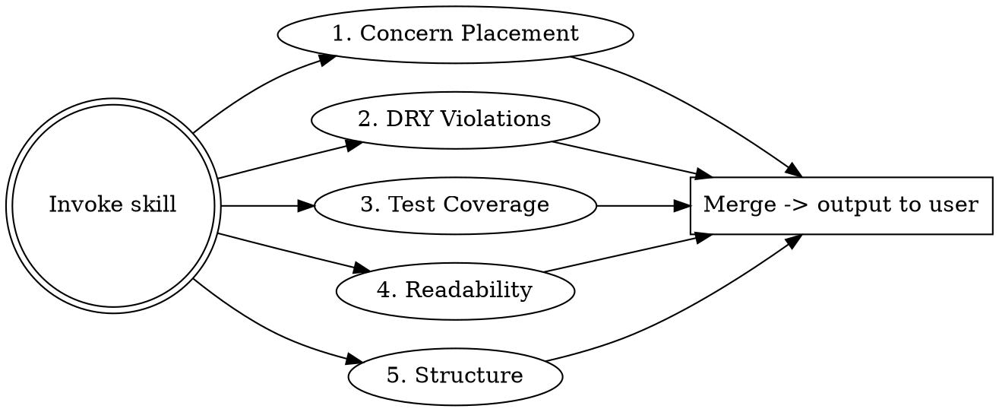

# Next.js Code Quality Audit

## Overview

Dispatch a team of specialized agents to audit a Next.js codebase in parallel. Each agent examines one concern. Results are merged and output directly to the conversation.

**Non-negotiable constraint:** No fix may change application behavior. Every recommendation targets code structure, test coverage, abstraction, or readability - never logic.

## When to Use

- Before a major refactor or release stabilization
- When inheriting or onboarding to a Next.js codebase
- When the codebase "feels messy" but you lack a concrete list of issues
- Periodic hygiene check on a long-lived project

## Agent Team

Dispatch **all five agents in parallel** using the Agent tool. Each agent returns its findings as structured output. After all complete, merge and output directly to the conversation.



### Agent 1 — Concern Placement

> "Is this check happening at the right level?"

Search for logic in pages/components that belongs elsewhere:

| Pattern | Should Be In |
|---------|-------------|
| Auth/session checks in page components | `middleware.ts` / `proxy.ts` |
| Redirect logic in pages | `middleware.ts` / `proxy.ts` |
| Header/cookie manipulation in API routes | `middleware.ts` / `proxy.ts` |
| Data validation duplicated across routes | Shared validation layer or zod schema |
| Layout-level data fetching repeated per page | Parent `layout.tsx` |
| Client-side feature flag checks | Edge middleware or server component |
| Permission guards in individual components | Higher-order layout or middleware |

**Prompt the agent with:**
> Search the entire codebase for auth checks, redirects, header manipulation, cookie reads, permission guards, and feature flag evaluations. For each, report WHERE it is and WHERE it should be. Only flag items where moving the concern upward would reduce duplication or improve correctness without changing behavior.

### Agent 2 — DRY Violations

> "Are we reimplementing the same thing in multiple places?"

Look for:
- Repeated fetch/API call patterns (same URL, same error handling)
- Duplicate form validation logic
- Copy-pasted utility functions across files
- Repeated Tailwind class combinations that should be a component
- Identical error boundary or loading state patterns
- Shared types/interfaces redefined in multiple files
- Same environment variable parsing in multiple locations

**Prompt the agent with:**
> Identify functions, patterns, and code blocks that appear in two or more files with only minor variation. Group findings by the abstraction that would eliminate the duplication (e.g., "extract a `useApiCall` hook", "create a shared `FormError` component"). Ignore duplication that is trivial (< 3 lines) or where abstracting would hurt readability.

### Agent 3 — Test Coverage & Correctness

> "Is the code well-tested and free of bugs?"

Examine:
- Files with no corresponding test file
- Functions with branching logic but no branch coverage
- API routes without integration tests
- Components with user interaction but no interaction tests
- Mocked dependencies that hide real integration issues
- Tests that test implementation details instead of behavior
- Missing edge case coverage (null, empty, error states)
- Tests that always pass (no meaningful assertions)

**Prompt the agent with:**
> Audit test coverage by correlating source files to test files. For each untested or under-tested file, describe what tests are missing and why they matter. Flag any tests that are testing implementation details rather than behavior, or that use mocks where integration tests would catch more real bugs. Do NOT suggest tests for trivial code (simple re-exports, type-only files).

### Agent 4 — Readability & Naming

> "Can a new developer understand this in one read?"

Look for:
- Functions longer than ~40 lines that do multiple things
- Unclear variable/function names (`data`, `result`, `temp`, `handleClick2`)
- Deeply nested conditionals (> 3 levels)
- Magic numbers and strings without named constants
- Inconsistent naming conventions across the codebase
- Comments that describe WHAT instead of WHY (or are stale)
- Complex expressions that should be extracted to a named variable
- Boolean parameters that obscure intent (`doThing(true, false, true)`)

**Prompt the agent with:**
> Read through all source files and flag readability issues. For each finding, provide the file, line range, the current code, and a brief description of the improvement. Focus on changes that meaningfully help a new developer understand the code. Skip nitpicks and style-only preferences.

### Agent 5 — Project Structure & Architecture

> "Is the project organized for maintainability?"

Look for:
- Barrel files (`index.ts`) that re-export everything and create circular dependencies
- Components in the wrong directory (shared component in a feature folder, or vice versa)
- API route handlers with business logic instead of calling a service layer
- Mixed concerns in single files (data fetching + rendering + state management)
- Unused exports, dead code, orphaned files
- Inconsistent file/folder naming conventions
- Missing or misconfigured TypeScript strict mode
- `any` types that could be properly typed

**Prompt the agent with:**
> Analyze the project's directory structure, imports graph, and file organization. Identify structural issues that make the codebase harder to navigate or maintain. Flag unused exports, dead code, circular dependencies, and files that mix multiple concerns. Suggest moves or splits only when they clearly improve organization — don't reorganize for the sake of reorganizing.

## Output

After all agents complete, merge findings and output them directly to the user. Do **not** write the report to a file. Use this structure:

```markdown
# Code Quality Audit - [Project Name]

> No fix changes application behavior.

## Summary

- **Total findings:** N
- **By severity:** Critical (N) | Moderate (N) | Minor (N)

## 1. Concern Placement

### [CP-001] Auth check in page should be in middleware
- **File:** `app/dashboard/page.tsx:15-28`
- **Severity:** Critical
- **Current:** Auth session check runs inside the page component
- **Recommended:** Move to `middleware.ts` to gate the entire `/dashboard` route
- **Why:** Eliminates repeated auth checks across all dashboard sub-pages

(...repeat for each finding)

## 2. DRY Violations

### [DRY-001] API error handling duplicated across 4 routes
- **Files:** `app/api/users/route.ts:20-35`, `app/api/posts/route.ts:18-30`, ...
- **Severity:** Moderate
- **Recommended:** Extract `withErrorHandling(handler)` wrapper
- **Why:** Single place to update error response format

(...repeat)

## 3. Test Coverage

### [TEST-001] No tests for checkout flow
- **File:** `app/checkout/page.tsx`
- **Severity:** Critical
- **Missing:** Integration test for form submission, validation, error states
- **Why:** Core business flow with branching logic and no safety net

(...repeat)

## 4. Readability

### [READ-001] `processData` function does 4 things in 80 lines
- **File:** `lib/data.ts:45-125`
- **Severity:** Moderate
- **Recommended:** Split into `validateInput`, `transformRecords`, `aggregateResults`, `formatOutput`
- **Why:** Each step is independently testable and nameable

(...repeat)

## 5. Project Structure

### [STRUCT-001] Business logic in API route handler
- **File:** `app/api/orders/route.ts`
- **Severity:** Moderate
- **Recommended:** Extract to `lib/services/orders.ts`, keep route as thin adapter
- **Why:** Service is reusable from server actions and testable without HTTP

(...repeat)
```

## Severity Guide

| Severity | Meaning |
|----------|---------|
| **Critical** | Actively causes maintenance pain, risk of bugs, or blocks scaling the team |
| **Moderate** | Clear improvement, worth doing in next cleanup cycle |
| **Minor** | Nice-to-have, fix opportunistically when touching nearby code |

## Rules for Agents

1. **No behavior changes.** Every recommendation must preserve existing functionality exactly.
2. **Be specific.** File paths, line numbers, concrete code references. No vague "consider improving."
3. **Explain WHY.** Every fix must state the benefit in human terms.
4. **Skip trivial.** Don't flag style preferences, formatting, or sub-3-line duplication.
5. **Group related.** If 5 files have the same issue, group them under one finding.
6. **Prioritize ruthlessly.** If the list exceeds 50 items, drop Minors until it fits.

## Common Mistakes

- **Flagging style as structure:** Semicolons, quote style, and trailing commas are linter concerns, not audit findings.
- **Suggesting rewrites:** The goal is targeted fixes, not "rewrite this module."
- **Missing the forest:** 20 Minor findings but missing that auth is checked in 15 different pages — focus on the high-impact patterns.
- **Changing behavior:** "This null check is unnecessary" — if removing it changes what happens on null input, it changes behavior. Don't flag it.
