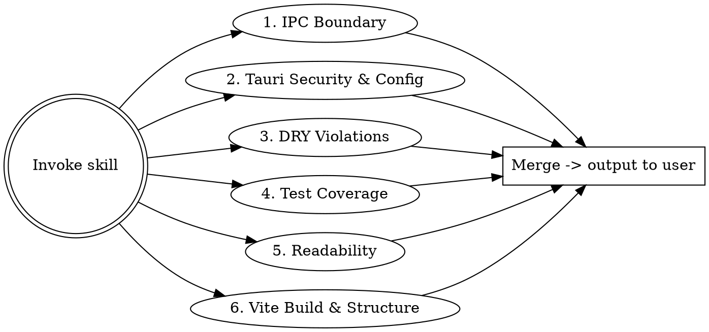

# Vite + Tauri Code Quality Audit

## Overview

Dispatch a team of specialized agents to audit a Vite + Tauri codebase in parallel. Each agent examines one concern across the JS/TS frontend AND the Rust/Tauri backend. Treat the project as one unit - the IPC boundary is part of the audit, not a wall between two audits. Results are merged and output directly to the conversation.

**Non-negotiable constraint:** No fix may change application behavior. Every recommendation targets code structure, test coverage, abstraction, security configuration, or readability - never logic.

## When to Use

- Before a major refactor or release stabilization
- When inheriting or onboarding to a Vite + Tauri codebase
- When the codebase "feels messy" but you lack a concrete list of issues
- After bumping Tauri major versions (v1 -> v2) and wanting a hygiene pass
- Periodic check on a long-lived desktop app

## Agent Team

Dispatch **all six agents in parallel** using the Agent tool. Each agent returns its findings as structured output. After all complete, merge and output directly to the conversation.



### Agent 1 - IPC Boundary & Concern Placement

> "Is this happening on the right side of the IPC boundary?"

Search for logic that lives on the wrong side of `invoke` / `#[tauri::command]`:

| Pattern | Should Be In |
|---------|-------------|
| File system access from JS via shell/Node shims | A `#[tauri::command]` in Rust |
| Heavy computation/parsing in the frontend | Rust command (off the UI thread) |
| Native crypto / hashing done in JS | Rust command using `ring`/`sha2` |
| Business rules duplicated in JS and Rust | Single source of truth in Rust, returned via command |
| Long-lived state held in JS that the backend also tracks | Tauri `State<T>` managed in Rust |
| Polling from JS for backend changes | Tauri event (`emit`/`listen`) |
| Window/menu/tray manipulation done via JS workarounds | `tauri::Window` / `Manager` API in Rust |
| Path manipulation using string concatenation in JS | `@tauri-apps/api/path` or Rust `PathBuf` |
| Hard-coded OS-specific branches in JS | Rust command using `cfg!(target_os = ...)` |
| `invoke` calls scattered across components | Typed wrapper module (`src/ipc/*.ts`) |

**Prompt the agent with:**
> Search the entire codebase for misplaced logic across the IPC boundary. List every `#[tauri::command]` in Rust and every `invoke()` call site in JS/TS. For each, decide whether the work belongs where it currently lives. Flag: business logic that exists on both sides, file/OS access shimmed in JS instead of a Rust command, heavy compute on the UI thread, polling that should be a Tauri event, and `invoke` calls that aren't routed through a typed wrapper module. Only flag items where moving the concern would reduce duplication, improve responsiveness, or remove a JS shim - not pure preference.

### Agent 2 - Tauri Security & Configuration

> "Is the attack surface as small as it can be?"

Examine `tauri.conf.json` (or `Tauri.toml`), capabilities files, and command registration:

- Overly broad capabilities/allowlist (`"all": true`, wildcard `**` scopes for `fs`/`shell`/`http`)
- Commands exposed to all windows when only one needs them
- `dangerousDisableAssetCspModification` / weak or missing `csp`
- `withGlobalTauri: true` left on in production
- Updater enabled without a pinned public key, or pubkey committed but rotation unclear
- Shell `open` / `execute` allowed with broad scope
- Custom protocol handlers without origin checks
- `#[tauri::command]` functions that take raw paths/URLs/SQL without validation
- Secrets (API keys, signing keys) read from JS-visible env (`VITE_*`) instead of Rust-only env
- `tauri::Window::eval` used to inject JS from Rust input
- `dialog`/`fs`/`http` plugins enabled but unused
- Missing `tauri.conf.json` `productName`/`identifier` review (collisions across builds)

**Prompt the agent with:**
> Read `src-tauri/tauri.conf.json`, every file in `src-tauri/capabilities/`, and `src-tauri/Cargo.toml`. Cross-reference declared permissions and enabled plugins against actual `invoke` call sites in the frontend and `#[tauri::command]` definitions in Rust. Flag: unused permissions still enabled, wildcards in fs/shell/http scopes, commands available to windows that don't call them, weakened CSP, updater config gaps, and any Rust command that accepts a path/URL/command string without validation. Also flag any secret that flows through a `VITE_*` env var (those ship in the bundle). Output severity based on real exposure, not theoretical risk.

### Agent 3 - DRY Violations

> "Are we reimplementing the same thing in multiple places?"

Look for:
- Repeated `invoke()` patterns (same command, same error handling, ad-hoc retry)
- Identical type definitions on the JS side that already exist as Rust structs (should be generated via `ts-rs`/`specta`/`tauri-specta`)
- Duplicate validation logic in JS and Rust (pick one canonical side)
- Copy-pasted Rust command bodies that differ only by table/entity name
- Repeated Tailwind/CSS class combinations that should be a component
- Identical error toast / dialog handling around every `invoke`
- Same env var parsing in multiple files (Rust or JS)
- Repeated event listener setup/teardown that should be a hook

**Prompt the agent with:**
> Identify functions, components, Rust modules, and code blocks that appear in two or more files with only minor variation. Group findings by the abstraction that would eliminate the duplication (e.g., "wrap `invoke` calls in `src/ipc/` with shared error handling", "generate TS types from Rust with tauri-specta instead of hand-maintaining both", "extract a `useTauriEvent` hook"). Ignore duplication that is trivial (< 3 lines) or where abstracting would hurt readability. Pay special attention to types that exist on both sides of the IPC boundary.

### Agent 4 - Test Coverage & Correctness

> "Is the code well-tested and free of bugs?"

Examine both sides:

**Frontend (Vitest / Playwright / WebdriverIO):**
- Components with no test, especially those that call `invoke`
- `invoke` wrappers without mocked-command tests
- Missing edge cases (loading, error, empty result from a command)
- E2E tests that don't actually exercise the Tauri runtime (running in a browser-only context)

**Rust (`cargo test`):**
- `#[tauri::command]` functions with no unit test for their core logic
- Functions with branching logic but no branch coverage
- Tests that mock the filesystem when `tempfile` would be more honest
- Missing tests for error variants (`Result::Err` paths never exercised)
- `unwrap()` / `expect()` in non-test code that should be a tested error path

**Prompt the agent with:**
> Audit test coverage on both sides of the IPC boundary. For the JS side, correlate components and `invoke` wrappers to test files. For the Rust side, correlate `#[tauri::command]` functions and `pub fn`s to `#[test]` / `#[cfg(test)]` modules. For each untested or under-tested unit, describe what tests are missing and why they matter. Flag mocks that hide real integration issues (e.g., mocking the filesystem when a `tempfile::tempdir()` would catch path bugs). Flag every `unwrap()`/`expect()` in production code paths and recommend either justification or a tested error path. Do NOT suggest tests for trivial code (simple re-exports, type-only modules, generated bindings).

### Agent 5 - Readability & Naming

> "Can a new developer understand this in one read?"

Look for, on both sides:
- Functions longer than ~40 lines that do multiple things
- Unclear names (`data`, `result`, `temp`, `handleClick2`, `cmd_v2`)
- Deeply nested conditionals (> 3 levels), or deeply nested `match` arms in Rust
- Magic numbers and strings without named constants
- Inconsistent naming: `snake_case` Rust commands invoked from JS without a consistent JS-side casing convention
- `#[tauri::command]` functions named after their HTTP-style action instead of the domain operation (`do_post` vs `publish_article`)
- Comments describing WHAT instead of WHY (or stale)
- Boolean parameters that obscure intent (`do_thing(true, false, true)`)
- Rust functions returning `Result<_, String>` that swallow context - should be a typed error enum with `thiserror`

**Prompt the agent with:**
> Read through all source files (JS/TS and Rust) and flag readability issues. For each finding, provide the file, line range, the current code, and a brief description of the improvement. On the Rust side, specifically flag commands returning stringified errors that lose context, and `match` chains that would read better as helper functions or `?` propagation. Focus on changes that meaningfully help a new developer understand the code. Skip nitpicks and style-only preferences.

### Agent 6 - Vite Build, Bundling & Project Structure

> "Is the project organized and built efficiently?"

Examine `vite.config.*`, `package.json`, `tsconfig.json`, `Cargo.toml`, and the directory layout:

**Vite-specific:**
- `VITE_*` env vars carrying anything that looks like a secret (they ship in the client bundle)
- Missing or misconfigured `build.target` for the Tauri webview (should match Tauri's minimum target, not browserlist defaults)
- No `manualChunks` strategy on a large app, leading to a single huge bundle
- Dev-only dependencies pulled into the production bundle
- `optimizeDeps` overrides that hide real import problems
- Source maps shipped to production unintentionally
- Plugins ordered incorrectly (e.g., compression before transformation)
- Multiple Vite configs out of sync between root and a workspace package

**Tauri / Rust workspace:**
- `src-tauri/` not isolated as its own Cargo workspace member when the project is a monorepo
- Features enabled in `Cargo.toml` that aren't used (`tauri = { features = ["..."] }`)
- Bundle identifiers / app names inconsistent between dev and prod profiles
- `tauri.conf.json` `build.beforeDevCommand` / `beforeBuildCommand` referencing scripts that no longer exist
- Resources / sidecars listed in config but missing from the repo

**General structure:**
- Barrel files (`index.ts`) that re-export everything and create circular dependencies
- IPC types defined in components instead of a dedicated `ipc/` module
- Mixed concerns in single files (data fetching + rendering + state)
- Unused exports, dead code, orphaned files
- `any` types that could be properly typed (especially around `invoke<T>(...)` call sites)
- Missing or relaxed TypeScript strict mode

**Prompt the agent with:**
> Analyze `vite.config.*`, `tsconfig.json`, `package.json`, `src-tauri/Cargo.toml`, `src-tauri/tauri.conf.json`, and the overall directory structure. Identify build, bundling, and organizational issues. Flag every `VITE_*` env var that names something secret-shaped (KEY, SECRET, TOKEN, PASSWORD) - those ship publicly. Flag unused Tauri features, stale beforeDevCommand scripts, missing source map config, missing manualChunks on bundles likely to be large, and `any` on `invoke<T>` call sites. Suggest moves or splits only when they clearly improve organization - don't reorganize for the sake of reorganizing.

## Output

After all agents complete, merge findings and output them directly to the user. Do **not** write the report to a file. Use this structure:

```markdown
# Code Quality Audit - [Project Name]

> No fix changes application behavior.

## Summary

- **Total findings:** N
- **By severity:** Critical (N) | Moderate (N) | Minor (N)

## 1. IPC Boundary

### [IPC-001] File read shimmed in JS instead of Rust command
- **Files:** `src/lib/loadConfig.ts:10-40`
- **Severity:** Critical
- **Current:** Frontend reads config via a Node-style shim that won't work in a packaged Tauri build
- **Recommended:** Add `#[tauri::command] fn load_config() -> Result<Config, ConfigError>` and call via a typed wrapper in `src/ipc/config.ts`
- **Why:** Removes a dev-only code path and lets Rust validate paths

(...repeat)

## 2. Tauri Security & Configuration

### [SEC-001] `fs` allowlist scope is `**`
- **File:** `src-tauri/capabilities/default.json:12`
- **Severity:** Critical
- **Current:** `"scope": ["**"]` grants read/write to the entire filesystem
- **Recommended:** Restrict to `$APPDATA/*` and the specific user-chosen directories opened via the dialog plugin
- **Why:** Compromise of any frontend dependency becomes filesystem-wide

(...repeat)

## 3. DRY Violations

### [DRY-001] `User` type hand-maintained in TS and Rust
- **Files:** `src/types/user.ts`, `src-tauri/src/models/user.rs`
- **Severity:** Moderate
- **Recommended:** Generate TS bindings from the Rust struct using `tauri-specta` (or `ts-rs`)
- **Why:** Single source of truth; drift here has already caused two bugs (per git log)

(...repeat)

## 4. Test Coverage

### [TEST-001] `import_database` command has no tests
- **File:** `src-tauri/src/commands/import.rs:15-90`
- **Severity:** Critical
- **Missing:** Unit tests for parse failure, partial-import rollback, and duplicate-row handling
- **Why:** User-data-destructive command with branching error paths and zero coverage

(...repeat)

## 5. Readability

### [READ-001] `process_records` does 4 things in 90 lines
- **File:** `src-tauri/src/services/records.rs:45-135`
- **Severity:** Moderate
- **Recommended:** Split into `validate_input`, `transform_records`, `aggregate_results`, `format_output`
- **Why:** Each step is independently testable and nameable

(...repeat)

## 6. Vite Build & Structure

### [BUILD-001] `VITE_STRIPE_SECRET_KEY` ships in the client bundle
- **File:** `.env`, `src/lib/payments.ts:5`
- **Severity:** Critical
- **Recommended:** Move secret to Rust-side env (`std::env::var`) and expose only the safe operations via `#[tauri::command]`
- **Why:** Anything prefixed `VITE_` is inlined into the production bundle and visible to users

(...repeat)
```

## Severity Guide

| Severity | Meaning |
|----------|---------|
| **Critical** | Actively causes maintenance pain, security exposure, real risk of bugs, or blocks scaling the team |
| **Moderate** | Clear improvement, worth doing in next cleanup cycle |
| **Minor** | Nice-to-have, fix opportunistically when touching nearby code |

Any leaked secret, overbroad allowlist, or destructive command without tests is **Critical** by default.

## Rules for Agents

1. **No behavior changes.** Every recommendation must preserve existing functionality exactly.
2. **Audit both sides.** JS/TS and Rust are one project. Findings that span the IPC boundary are usually the highest value.
3. **Be specific.** File paths, line numbers, concrete code references. No vague "consider improving."
4. **Explain WHY.** Every fix must state the benefit in human terms.
5. **Skip trivial.** Don't flag style preferences, formatting, or sub-3-line duplication.
6. **Group related.** If 5 files have the same issue, group them under one finding.
7. **Prioritize ruthlessly.** If the list exceeds 50 items, drop Minors until it fits.

## Common Mistakes

- **Auditing only the JS side.** Half the project lives in `src-tauri/`. Missing it misses the highest-impact findings.
- **Treating broad allowlists as Moderate.** A wildcard `fs` scope on a shipping desktop app is Critical.
- **Flagging style as structure.** Semicolons, quote style, trailing commas are linter concerns, not audit findings.
- **Suggesting rewrites.** The goal is targeted fixes, not "rewrite this module."
- **Recommending a Tauri v1 -> v2 migration as part of the audit.** That's a separate project.
- **Changing behavior.** "This null check is unnecessary" - if removing it changes what happens on null input, it changes behavior. Don't flag it.
